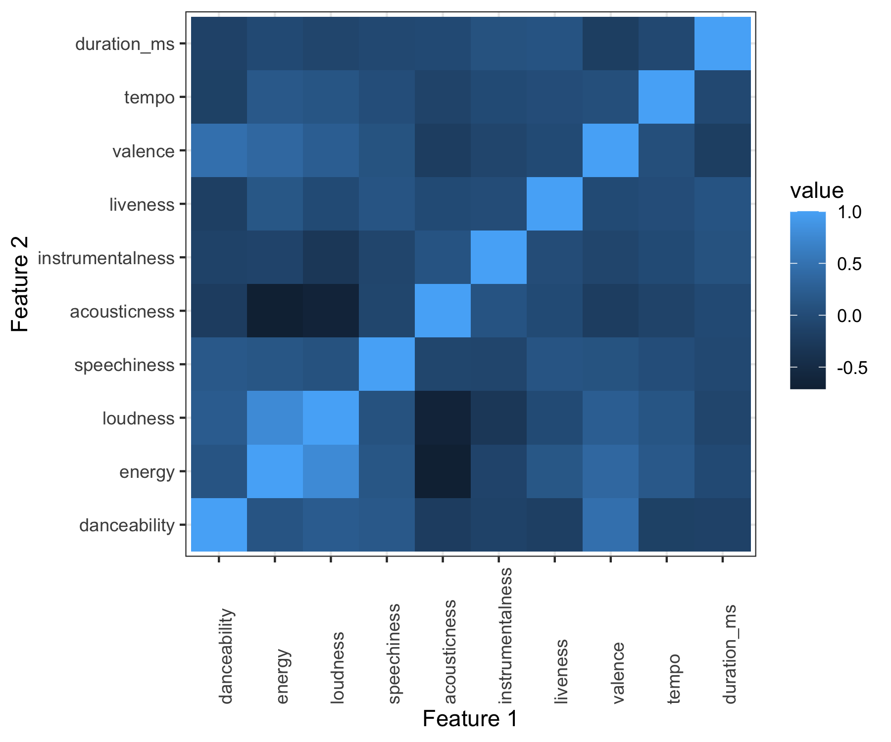

```{r setup, include=FALSE, message = FALSE}
options(scipen = 0, digits = 3)  # controls number of significant digits printed
library(tidyverse)
library(kableExtra)
```

\bigskip

The code to reproduce this report is available [on Github](https://github.com/bnajete/stat471-final-project).

\newpage

# Executive Summary

**Problem.** 
According to the Wikipedia definition, a music genre is "a conventional category that identifies some pieces of music as belonging to a shared tradition or set of conventions". Many different genres and even mix of genres exist nowadays. Users can even find it hard to classify some of the music they listen to or songs in general as belonging to a specific genre. Reading through Spotify's API's description, we found out that the music platform has created a set of features to characterize a song and it made us wonder if these features might allow us to predict and therefore characterize the genre of music a song belongs to. A classification like this one would permit defining what the genre of a song really is and could be beneficial to improve music recommendation systems.

**Data.** 
Our dataset pulled data from two sources : the Spotify developer API, which allowed us to retrieve the audio features of the songs that were going to be part of the dataset and the LastFM API, which we used to find the genre of each of the tracks. The study focused on six music genres : Country, Hip-Hop, Jazz, Pop, RnB and Rock.

**Analysis.** 
Before exploring our data or running any analyses, we split our data into a training dataset and a test dataset, with the test dataset reserved for assessing and comparing model performance. Then, we explored our data to assess correlations between variables and between variables and the response. In order to build an optimal predictive model, we then built three different cross-validated models: a classification tree, random forest and a multi-class logistic model. We also tried to implement a boosting model in addition to the other tree-based models, but the multi-class classification seemed to cause an exremely high misclassification and we therefore chose to take out this model.

**Conclusions.** 
Unfortunately, it looks like none of the models we used were efficient enough to create a real and accurate tool for classifying music genre. We think that it is unlikely that the  inaccuracy of our models could have been caused by some class imbalances seeing how we made sure that each of the classes would be roughly equivalently represented. It could then have been caused by a lack of correlation between the set of features created by Spotify or by a dataset too small to tackle such a big classification task.

\newpage

# Introduction

**Background.** 
Spotify, a Swedish Audio streaming and media services, is one of the largest music streaming service provider. Founded 15 years ago, it has been able to confirm itself as one of the main actors of the music industry and includes more than 70 million songs. It has even broaden its offer by adding podcasts and is present internationally.

Against some of its competitors, it is often cited that one of Spotify's strengths is their personalized playlists, created weekly or monthly, and that allow a user to discover new songs according to their taste and their listening habits. 


**Analysis goals.** 
Given the characteristics established for each track available on Spotify, we sought to investigate how accurately we could predict one track's accredited genre on the radio and which specific characteristics are most predictive of a track's genre. We will evaluate the success of the different classification models by evaluating the misclassification errors of each contemplated model.


**Significance.** 
Recommendation systems are a strength for the Spotify platform and we ought to keep on improving it by making it as tuned with each user as possible. One possible track for improving this recommendation system would be the genre approach and that's why we think that this specific classification task can be useful, even more so that one can often notice genre classifications lacking coherency from time to time.

\newpage 

# Data

## Data sources

Our dataset merged data from two sources: the Spotify developer API for the regular information about a track as well as the Spotify features and the Last.fm API for the genre of a track. 

The data regarding the regular information about a track comes from the Spotify developer API.^[Spotify Developer API Documentation https://developer.spotify.com/documentation/] This API was designed and created to help people developing applications using various Spotify functionalities. 

Specifically, we started the data retrieval by using a method allowing the user to retrieve a list of artists signed by a designated music label and a method allowing the user to retrieve all the audio features of the entire discography of a specified artist. 

Seeing how the genre distribution in the resulting dataset was not as satisfying as expected, we decided to enrich it by retrieving songs that belonged to a specific genre on the Last.fm developer API ^[Last.fm API https://www.last.fm/api] before getting the corresponding audio features from Spotify. The Last.fm API stores many characteristics and one of them is named "tags", which often contain the genre of a track. Last.fm tags are freeform, but they tend to include commonly recognized genres.

## Data cleaning

Our central task in the data cleaning phase of the project was merging the data from the two sources described above. In both data sources, the tuple consisting of the title of a track and the name of the performing artist was used as a unique key. We were then able to join these two tibbles on the features we have just cited. We also had to drop missing values which were caused by various glitches in some of the API calls.

While running the first approach described above, there were a lot of cleaning made on the tags data. For instance, we had to make sure that the genre retrieved from the Last.fm API were actual genres because since the "tags" are freeform, they sometimes don't refer to an actual genre. We also needed to clean the retrieved tags, especially when the retrieved tag was a mix of genres. Accordingly, when the retrieved tags were a mix of multiple genres, we made the decision to only keep the last genre (pop rock became rock).


## Data description

### Observations

Our dataset has a total of 4,538 observations, each corresponding to a different and unique song.

### Response Variable

Our response variable is a categorical response which characterizes the genre of the song, taking value in a list of six different genres : Country, Hip-Hop, Jazz, Pop, RnB and Rock. We used this list of genres because we thought that those were the more commonly listened to and the more global - a lot of music genre are just branches from these more global ones. However, these genres we picked for our study may be too restrictive or too similar and that may cause a lack of accuracy in our predictive models.


### Features

Drawing on data from both APIS, our dataset contains 18 features. For a detailed specification of these variables, refer to Appendix \@ref(appendix).

## Data allocation

Before building our predictive models, we first removed observations from the dataset for which any variables had NA values. We decided to do this for consistency purposes, as some data analysis methods we employed require that no variables contain NA fields. We then split our dataset into two subsets: a training dataset used for building our predictive models and a test dataset used for evaluating our models. We used an 80-20 split, such that the training dataset consists of 80% of our observations and the dataset consists of 20% of our observations.  

## Data exploration

### Response

We first sought to understand how many observations belong to each music genre. As we see in Table \@ref(tab:observations-class), the train data is roughly equally distributed amnong the six different genres.

```{r observations-class, message = FALSE, echo = FALSE, fig.pos = "H"}
read_tsv("../results/observations_class.tsv") %>%
  kable(format = "latex", row.names = NA,
        booktabs = TRUE, 
        col.names = c("Music Genre", "Count"),
        caption = "Number of observations in each class") %>%
  kable_styling(position = "center")
```

### Features

We then looked at what are the variations of the various audio characteristics given by Spotify depending on the genre of the songs. We first plotted boxplots illustrating the distribution of the continuous audio characteristics.

```{r features-boxplots-1, out.width = "60%", fig.cap = "Distribution of the five first continous audio characteristics by genre", fig.align='center', echo = FALSE, fig.pos = "H"}

```

```{r features-boxplots-2, out.width = "60%", fig.cap = "Distribution of the five last continous audio characteristics by genre", fig.align='center', echo = FALSE, fig.pos = "H"}

```
We can observe in Figure \@ref(fig:features-boxplots-1) Hip-Hop and RnB have the highest danceabilities, which makes sense. We can also see that Rock is the most energetic genre out of the six genres. Also, Jazz has in general the lowest loudness but has clearly the highest acousticness. In Figure \@ref(fig:features-boxplots-2), it is noticeable that the songs duration are quite similar as well as the tempo. Furthermore, the liveness distributions across all genres are similarly low, which is a good sign seeing how we are not supposed to have live songs in our data.

We then proceeded to study the correlation existing between the different  continuous features.
```{r heatmap-features, out.width = "60%", fig.cap = "Correlation between the different continuous features", fig.align='center', echo = FALSE, fig.pos = "H"}

```
In Figure \@ref(fig:heatmap-features), the main correlations between features that can be seen are that loudness and energy seem to be correlated (meaning that a song that has a high value for the loudness characteristic would also have a high value for the energy characteristic) and that loudness and energy are seem to be both negatively correlated with acousticness.

# Modeling

## Tree-based methods

### Decision tree
The first method we decided to implement was the decision tree. In order to have the most accurate model possible, we decided to find a tree of optimal size via pruning and cross-validation. We therefore picked the decision tree that minimized the cross-validation error, like pictured in Figure \@ref(fig:cv-error-decision-tree).
```{r cv-error-decision-tree, out.width = "60%", fig.cap = "Cross-validation error for the different value of terminal nodes in the decision tree", fig.align='center', echo = FALSE, fig.pos = "H"}

```
```{r optimal-tree-info, message = FALSE, echo = FALSE, fig.pos = "H"}
read_tsv("../results/optimal_tree_info.tsv") %>%
  kable(format = "latex", row.names = NA,
        booktabs = TRUE, 
        col.names = c("CP", "Number of splits", "Rel error", "X error", "X standard deviation"),
        caption = "Optimal tree information") %>%
  kable_styling(position = "center")
```
As we see in Table \@ref(tab:optimal-tree-info), the optimal tree has 17 splits and therefore 18 terminal nodes.
After training this optimal tree, we found a misclassification error of 57.5%  on the test set. This misclassification error is pretty high, but still lower than the dummy classifier which would be wrong 5 out of 6 times seeing how the classes are approximately equally balanced.

### Random forest

When we trained the random forest model, we picked a number of trees of 500 and decided to tune the value of m.
```{r m-tuning, out.width = "60%", fig.cap = "Tuning of the m value for the random forest model", fig.align='center', echo = FALSE, fig.pos = "H"}

```

We can see in Figure \@ref(fig:m-tuning) that the optimal value for m is 1, which is lower than the default value of 3. Furthermore, we can see in Figure \@ref(fig:var-importance) that for both metrics, speechiness and acousticness are among the most important variables in the random forest model.

```{r var-importance, out.width = "60%", fig.cap = "Variable importance for the random forest model", fig.align='center', echo = FALSE, fig.pos = "H"}

```
After training this optimal random forest model, we found a misclassification error of 69.4%  on the test set. This misclassification error is pretty high, but still lower than the dummy classifier which would be wrong 5 out of 6 times seeing how the classes are approximately equally balanced.

## Deep-learning method

### Multi-class logistic model

The multi-class logistic model was built after reformatting the train and test data. We applied a one-hot encoding on the testing data and turned the training tibble into an array in order to make the keras model work.


```{r history-plot, out.width = "60%", fig.cap = "Plot of the model history", fig.align='center', echo = FALSE, fig.pos = "H"}

```


We built the multi-class logistic model using a "categorical crossentropy" loss with an "adam" optimizer using the "accuracy" metrics. We then fit the model with 10 epochs and a batch size of 32 (other values for the size of the batch didn't give any better results on the test accuracy).

After training this model, we found an accuracy of 17.4% on the test set, which corresponds to a misclassification error of more than 82%, which is approximately as bad as the dummy classifier.

# Conclusions

## Method comparison

```{r model-evaluation, message = FALSE, echo = FALSE}
read_tsv("../results/model-evaluation.tsv") %>%
  kable(format = "latex", row.names = NA,
        booktabs = TRUE, digits = 2,
        caption = "Misclassification error for all three models.") %>%
  kable_styling(position = "center")
```

Table \@ref(tab:model-evaluation) shows the misclassification error for all the methods considered. Surprisingly, the decision tree is the most accurate model. Overall, all three model are not good classifiers, with the multi-class logistic model doing as bad as the random classifier. This is really surprising seeing how we assumed this particular model would be the best out of the threes. This could maybe be explained by overfitting but it doesn't look like the validation loss is going up in Figure \@ref(fig:history-plot) which would be a proof of overfitting.


## Takeaways
 
Our results show that, even if we're convinced that an efficient and accurate prediction of a song genre would be a good addition to the song recommender system, the strategy chosen for this study was not the right one. It could be caused by a glitch in the data we gathered or by the fact that the features given by Spotify are not correlated enough with the genre classification.

Some issues present in the gathered data could be the size of the data set : it is possible that a bigger data set would have led to better models. It is also possible that the genre classification obtained with the Last.fm APIwere somewhat wrong.

## Limitations

### Dataset limitations

In addition to the fact that we could always get more songs, we can think of one possible limitation in the retrieved data. Indeed, as described in the part describing the data sources, the retrieved songs were retrieved because they were present in  the top tracks for a specific tag in the Last.fm API. However, we weren't able to retrieve all of the discographies of the retrieved artists because the at one point the api calls broke so that led to a smaller dataset than intended as well as maybe some issues with the genre tag retrieved from the Last.fm database.


## Follow-ups

To compensate for the limitations mentioned above, more extensive analysis can be done as one with more computation power and more time can acquire more data (no API calls breaking after a while). Not only can this analysis be expanded by using a bigger dataset, but a bigger dataset could also allow to categorize into more specific genres in the future. 

\appendix

# Appendix: Descriptions of features {#appendix}

Below are the features contained in the dataset. Words written in parentheses represent variable names.

  - Name of the artist (`artist_name` - character): Name of the artist performing the song.
  - Artist identifier (`artist_id` - character): The unique identifier used to identify an artist on Spotify.
  - Name of the song (`track_name` - character): Title of the song.
  - Track identifier (`track_id` - character): The unique identifier used to identify a track on Spotify.
  - Danceability (`danceability` - number):  Danceability describes how suitable a track is for dancing based on a combination of musical elements including tempo, rhythm stability, beat strength, and overall regularity. A value of 0.0 is least danceable and 1.0 is most danceable.
  - Energy (`energy` - number):  Energy is a measure from 0.0 to 1.0 and represents a perceptual measure of intensity and activity. Typically, energetic tracks feel fast, loud, and noisy. For example, death metal has high energy, while a Bach prelude scores low on the scale. Perceptual features contributing to this attribute include dynamic range, perceived loudness, timbre, onset rate, and general entropy.
  - Loudness (`loudness` - number): The overall loudness of a track in decibels (dB). Loudness values are averaged across the entire track and are useful for comparing relative loudness of tracks. Loudness is the quality of a sound that is the primary psychological correlate of physical strength (amplitude). Values typically range between -60 and 0 db.
  - Mode (`mode` - factor): Mode indicates the modality (major or minor) of a track, the type of scale from which its melodic content is derived. Major is represented by 1 and minor is 0.
  - Speechiness (`speechiness` - number): Speechiness detects the presence of spoken words in a track. The more exclusively speech-like the recording (e.g. talk show, audio book, poetry), the closer to 1.0 the attribute value. Values above 0.66 describe tracks that are probably made entirely of spoken words. Values between 0.33 and 0.66 describe tracks that may contain both music and speech, either in sections or layered, including such cases as rap music. Values below 0.33 most likely represent music and other non-speech-like tracks.
  - Acousticness (`acousticness` - number): A confidence measure from 0.0 to 1.0 of whether the track is acoustic. 1.0 represents high confidence the track is acoustic.
  - Instrumentalness (`instrumentalness` - number): Predicts whether a track contains no vocals. "Ooh" and "aah" sounds are treated as instrumental in this context. Rap or spoken word tracks are clearly "vocal". The closer the instrumentalness value is to 1.0, the greater likelihood the track contains no vocal content. Values above 0.5 are intended to represent instrumental tracks, but confidence is higher as the value approaches 1.0.
  - Liveness (`liveness` - number): Detects the presence of an audience in the recording. Higher liveness values represent an increased probability that the track was performed live. A value above 0.8 provides strong likelihood that the track is live.
  - Valence (`valence` - number) : A measure from 0.0 to 1.0 describing the musical positiveness conveyed by a track. Tracks with high valence sound more positive (e.g. happy, cheerful, euphoric), while tracks with low valence sound more negative (e.g. sad, depressed, angry). 
  - Tempo (`tempo` - number): The overall estimated tempo of a track in beats per minute (BPM). In musical terminology, tempo is the speed or pace of a given piece and derives directly from the average beat duration.
  - Time signature (`time_signature` - factor): An estimated time signature. The time signature (meter) is a notational convention to specify how many beats are in each bar (or measure). The time signature ranges from 3 to 7 indicating time signatures of "3/4", to "7/4".
  - Song duration (`duration_ms` - number): The duration of the track in milliseconds.
  - Explicit (`explicit` - boolean): Whether the lyrics of the song are explicit or not.
  - Genre of the track (`track_genre` - factor): One of the six genres chosen for the analysis (Country, Hip-Hop, Jazz, Pop, Rnb, Rock)
